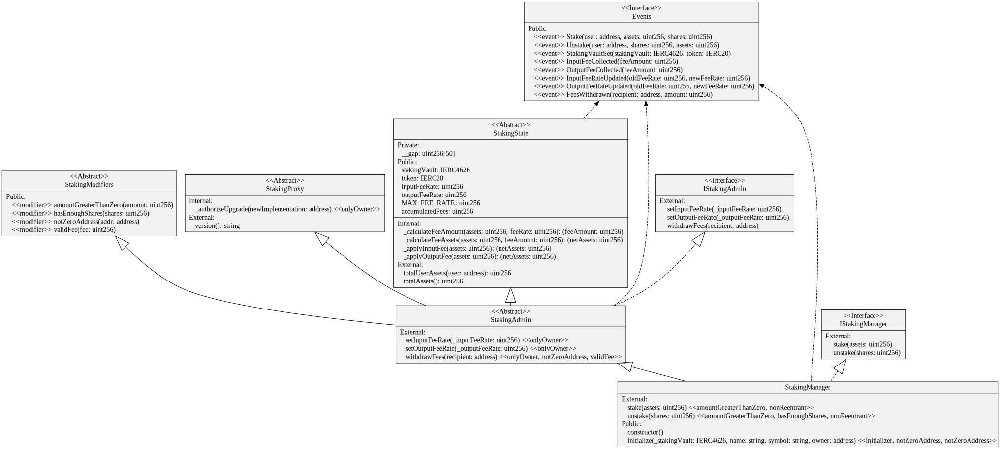

# StakingManager

[](https://github.com/The-Poolz/StakingManager/actions/workflows/node.js.yml)
[](https://codecov.io/gh/The-Poolz/StakingManager)
[](https://github.com/The-Poolz/StakingManager/blob/master/LICENSE)

**`StakingManager`** is an **upgradeable Solidity** smart contract that enables users to stake **ERC-20** tokens into an **IERC4626** compatible vault with a **dual fee system**. When users stake, they receive **ERC-20** "staking shares" that represent their position. These shares can be redeemed later for the underlying assets along with any accrued yield. The contract features **input fees** (on staking) and **output fees** (on unstaking) with basis point precision. Built with **UUPS proxy pattern** for seamless upgrades while preserving user state. This project uses [Hardhat](https://hardhat.org/) for development and testing.

## 📚 Table of Contents

-   [**Features**](#features)
-   [**Setup**](#setup)
    -   [**Requirements**](#requirements)
    -   [**Installation**](#installation)
    -   [**Compilation**](#compilation)
    -   [**Running Tests**](#running-tests)
    -   [**Test Coverage**](#test-coverage)
    -   [**Deployment**](#deployment)
    -   [**Network Configuration**](#network-configuration)
    -   [**Environment Variables**](#environment-variables)
-   [**UML Diagram**](#uml-diagram)
-   [**Functions Overview**](#functions-overview)
-   [**Usage Example**](#usage-example)
-   [**License**](#license)

---

## Features

-   🚀 **Upgradeable Contract Architecture** - UUPS proxy pattern for seamless upgrades
-   💰 **Dual Fee System** - Separate input and output fees with basis point precision
-   🏦 **ERC4626 Vault Integration** - Compatible with any ERC4626 yield-bearing vault
-   🪙 **ERC20 Token Representation** - Staked assets represented as transferable shares
-   🔒 **Access Control** - Owner-based fee management and upgrade authorization
-   📊 **Fee Accumulation** - Automatic fee collection and withdrawal functionality
-   🛡️ **Security Features** - Comprehensive validation and error handling
-   ⚡ **Gas Optimized** - Efficient operations with custom errors

---

# Setup

## Requirements

-   Node.js v18 or later
-   npm

## Installation

Install the dependencies defined in `package.json`:

```bash
npm install
```

## Compilation

Compile the contracts using Hardhat:

```bash
npx hardhat compile
```

## Running Tests

The unit tests are written with Hardhat and Chai. Execute them with:

```bash
npx hardhat test
```

## Test Coverage

Generate a test coverage report (requires solidity-coverage):

```bash
npx hardhat coverage
```

Coverage results are stored in the **coverage/** directory

## Deployment

Deploy scripts live in the `scripts` folder. The StakingManager uses upgradeable proxy pattern:

```bash
# Deploy upgradeable StakingManager with proxy
npx hardhat run scripts/deploy.ts --network <network>

# Run dual fee system example
npx hardhat run scripts/dualFeeExample.ts --network <network>

# Upgrade existing deployment
npx hardhat run scripts/upgradeContract.ts --network <network>
```

Replace `<network>` with one of the configured networks (see below).

### Upgrade Process

The contract uses OpenZeppelin's UUPS proxy pattern for upgrades:
1. **Deploy**: Initial deployment creates proxy and implementation
2. **Upgrade**: New implementation deployed, proxy updated
3. **State Preserved**: All user balances and fees maintained across upgrades

## Network Configuration

Networks are defined in `hardhat.config.ts`.

-   `hardhat` – local network with a high block gas limit.
-   `bscTestnet` – Binance Smart Chain testnet at `https://data-seed-prebsc-1-s1.binance.org:8545`.
-   `bsc` – Binance Smart Chain mainnet at `https://bsc-dataseed.binance.org/`.

To deploy to BSC networks you must provide a private key and BscScan API key.

## Environment Variables

Create a `.env` file in the project root and supply the following variables
as needed by `hardhat.config.ts`:

```env
PRIVATE_KEY=your_private_key         # used for deployments
ETHERSCAN_API_KEY=your_etherscan_key # verification on Ethereum networks
BSCSCAN_API_KEY=your_bscscan_key     # verification on BSC networks
CMC_API_KEY=your_coinmarketcap_key   # for gas reporter
```

These variables are optional for local development but required for network
deployments and contract verification.

## UML diagram


## Functions Overview

### Stake

```solidity
function stake(uint256 assets) external;
```

Stakes **ERC-20** tokens into the vault. Transfers `assets` from the user to the contract, deposits them into the vault, and mints ERC-20 shares as proof of stake.

**Emits**:

```solidity
emit Stake(address user, uint256 assets, uint256 shares)
```

### Unstake

```solidity
    function unstake(uint256 shares) external;
```

Unstakes tokens by redeeming vault shares. Burns the user's shares and transfers the equivalent amount of underlying assets back to them.
**Emits**:

```solidity
emit Unstake(address user, uint256 shares, uint256 assets)
```

### totalUserAssets

```solidity
function totalUserAssets(address user) external view returns (uint256);
```

Returns the total amount of underlying assets the user has staked, calculated from their share balance.

### totalAssets

```solidity
function totalAssets() external view returns (uint256);
```

Returns the total value of assets staked in the vault on behalf of this contract.

## Usage Example

```ts
import { ethers } from "hardhat"
import { StakingManager, ERC20 } from "../typechain-types"

async function main() {
    const [deployer] = await ethers.getSigners()

    const stakingManager = (await ethers.getContractAt("StakingManager", "<staking_manager_address>")) as StakingManager

    const token = (await ethers.getContractAt("ERC20", "<token_address>")) as ERC20

    const amount = ethers.parseEther("1000")

    // Approve stakingManager to transfer tokens
    const approveTx = await token.approve(await stakingManager.getAddress(), amount)
    await approveTx.wait()

    // Stake tokens
    const stakeTx = await stakingManager.stake(amount)
    await stakeTx.wait()

    // Check user's shares
    const shares = await stakingManager.balanceOf(await deployer.getAddress())

    // Unstake tokens
    const unstakeTx = await stakingManager.unstake(shares)
    await unstakeTx.wait()

    console.log(`Staked and unstaked ${amount} tokens successfully.`)
}

main().catch((error) => {
    console.error(error)
    process.exit(1)
})
```

-   Replace **<staking_manager_address>** and **<token_address>** with actual deployed contract addresses.

## License

This project is licensed under the [MIT License](LICENSE).
